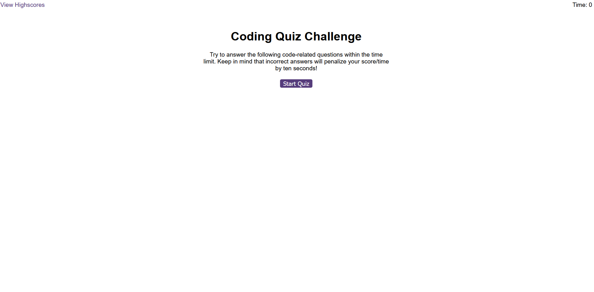
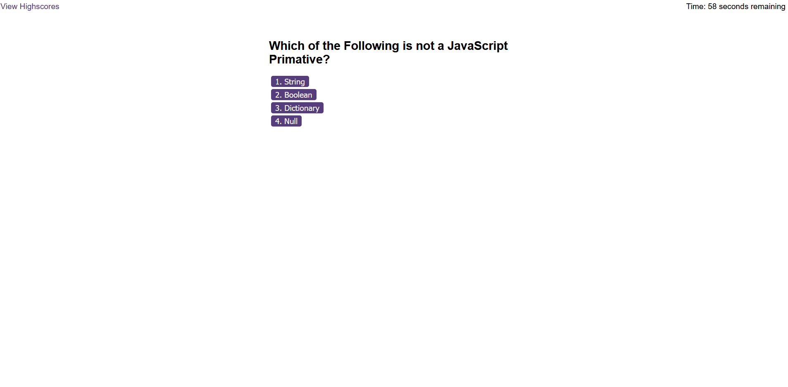
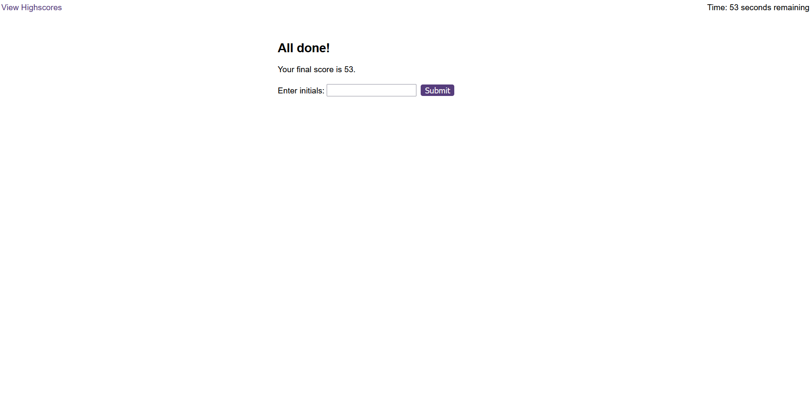

# Coding Quiz

## Table of Contents
1. [URL](#url)
2. [Description](#description)
3. [Installation](#installation)
4. [Usage](#usage)
5. [Credits](#credits)

## URL 

## Description 

This page was created as my solution to the sixth challenge task of a web
development bootcamp. For this task, I was provided with starter code including
the HTML layout for a browser-based coding quiz game, as well as the HTML code
for a highscore page for the game and all the necessary CSS styling. My task was
to create the JavaScript code to allow users to play the game and to save their
initials/name on completion of the game, as well as to display the scores and
initials on the highscore page.

In addition, the challenge carried the following restrictions and requirements:
1. The game must include a start button that starts the timer and displays the
   first question when clicked.
2. Each question must include a series of buttons for each answer.
3. When the answer button is clicked, the next question must appear.
4. If the answer is incorrect, time must be subtracted from the clock.
5. If the user answers all of the questions or the timer reaches 0, the game
   ends.
6. When the game ends, the user's score should be displayed and they should have
   the opportunity to save their initials and their score.

On first opening index.html or loading the live version of the page, a user
should see the start screen as follows:

After clicking the "Start Quiz" button, the quiz will then begin. At this point,
the start screen will disappear and be replaced by the quiz interface. The user
will see 5 questions in succession and a timer will start in the top right hand
corner of the page. The quiz interface can be seen in the following image:

Finally, after completing the quiz successfully, the user wil be shown their
final score, which will be the amount of time remaining when the user finished
the quiz. At this point, the user will be prompted to enter their initials. The
quiz end screen can be seen in the following image:

Should a user fail to complete the quiz by running out of time and/or getting
enough questions wrong, the user will achieve a score of 0. If this happens, the
user will not be prompted for their initials and will instead be shown the
following screen:

## Installation 

## Usage 

## Credits 
This project was completed by myself -- Neal Reeves. The content contained in
the logic.js and scores.js files was written entirely by myself. However, this
project also used starter code provided by edX as part of their Front End Web
Development bootcamp. This included the contents of the index.html,
highscores.html and styles.css files.
